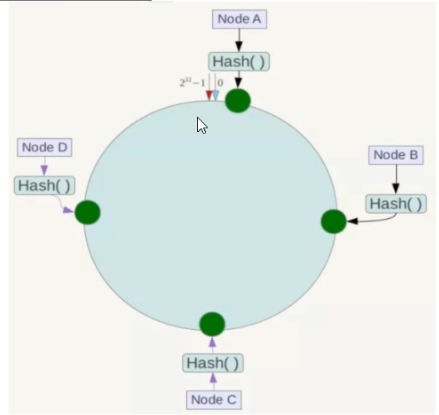
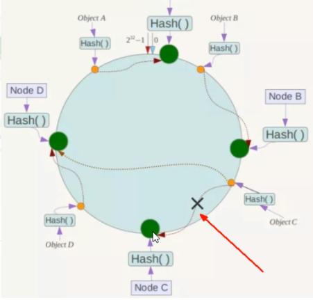
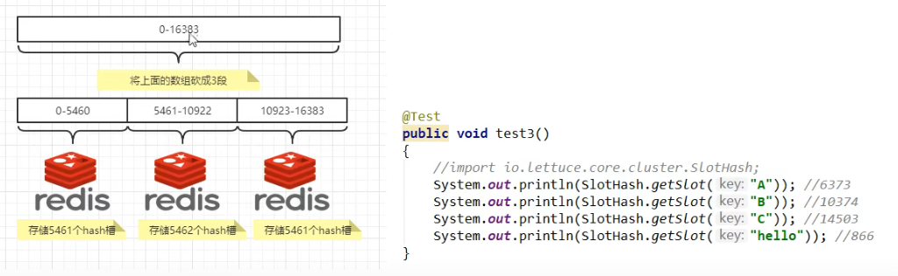

# docker复杂安装

## 安装mysql主从复制

### 1、主从复制原理

### 2、主从搭建步骤

1. **新建主服务器容器3307**

  ```
  # 创建一个新的容器
  docker -run -p 3307:3306 --name mysql-master
  # 绑定一个容器卷
  -v /mydata/mysql-master/log：/var/log/mysql
  -v /mydata/mysql-master/data:/var/lib/mysql
  -v /mydata/mysql-master/conf:/etc/mysql
  -e MYSQL_ROOT_PASSWORD=root
  -d mysql:5.7
  ```

2. **进入/mydata/mysql-master/conf 目录下新建my.cnf**

   

3. **修改完重启mysql-master容器**

   ```
   docker restart mysql-master
   ```

4. **进入mysql-master容器**

   ```
   docker exec -it mysql-master /bin/bash
   mysql -uroot -proot
   ```

5. **master容器实例内创建数据同步用户**

   ```
   # 创建slave用户，密码123456
   CREATE USER'slave'@'%'IDENTIFIED BY'123456';
   # 授权
   GRANT REPLICATION SLAVE,REPLICATION CLIENT ON *.* TO 'slave'@'%'
   ```

6. **新建从服务器容器3308**

   ```
   # 创建一个新的容器
   docker -run -p 3308:3306 --name mysql-slave
   # 绑定一个容器卷
   -v /mydata/mysql-slave/log：/var/log/mysql
   -v /mydata/mysql-slave/data:/var/lib/mysql
   -v /mydata/mysql-slave/conf:/etc/mysql
   -e MYSQL_ROOT_PASSWORD=root
   -d mysql:5.7
   ```

7. **进入/mydata/mysql-slave/conf 目录下新建my.cnf**

   

8. **修改完配置后重启slave实例**

   ```
   docker restart mysql-slave
   ```

9. **在主数据库中查看主从同步状态**

   ```
   show master status
   ```

10. **进入mysql-slave容器**

    ```
    docker exec -it mysql-slave /bin/bash
    mysql -uroot -proot
    ```

11. **在从数据库中配置主从复制**

    ```
    change master to master_host='宿主机ip',master_user='slave',master_password='123456',
    master_port=3307,master_log_file='mall-mysql-bin.000001',master_log_pos=617,
    master_connect_retry=30;
    ```

    **主从复制命令参数说明**

    master_host:主数据库的IP地址;

    master_port:主数据库的运行端口;

    master_user:在主数据库创建的用于同步数据的用户账号;

    master_password:在主数据库创建的用于同步数据的用户密码;

    master_log_file:指定从数据库要复制数据的日志文件,T通过查看主数据的状态，获取File参数;

    master_log_pos:指定从数据库从哪个位置开始复制数据，通过查看主数据的状态，获取Position参数;

    master_connect_retry:连接失败重试的时间间隔，单位为秒。

12. **在从数据库中查看主从同步状态**

    ```
    # \G 展示k，v键值对
    show slave status \G;
    ```

13. **在从数据库中开启主从同步**

    ```
    start slave
    ```

14. **查看从数据库发现已经同步**

    ```
    show slave status \G"
    ```

15. **主从复制测试**


## 安装redis集群

cluster（集群）模式-dokcer版本 ，哈希槽分区进行亿级数据存储

### **面试题**

1~2亿条数据需要缓存，请问如何设计这个存储案例？

**答：**

单机单台100%不可能，肯定是分布式存储，如何用redis实现？

### **三种方案**

#### **一、哈希取余分区**

2亿条记录就是2亿个kv，我们单机不行必须要分布式多机，假设有3台机器构成一个集群，用户每次读写操作都是根据公式:hash(key)%N个机器台数，计算出哈希值，用来决定数据映射到哪一个节点上。

##### **优点**

简单相暴，直接有效，只需要预估好数据规划好节点，例如3台、8台、10台，就能保证一段时间的数据支撑。使用Hash算法让固定的一部分清求落到同一台服务器上，这样每台服务器固定处理一部分请求（并维护这些请求的信息)，起到负载均衡+分而治之的作用。

##### **缺点**

原来规划好的节点，进行扩容或者缩容就比较麻烦了额，不管扩缩，每次数据变动导致节点有变动，映射关系需要重新进行计算，在服务器个数固定不变时没有问题，如果需要弹性扩容或故障停机的情况下，原来的取模公式就会发生变化:Hash(key/3会变成Hash(key) 2。此时地址经过取余运算的结果将发生很大变化，根据公式获取的服务器也会变得不可控。假如某个redis机器宕机了，由于台数数量变化，会导致hash取余全部数据重新洗牌。

#### **二、一致性哈希算法分区**

##### **是什么**

一致性哈希算法在1997年由麻省理工学院中提出的，设计目标是为了解决分布式缓存数据变动和映射问题，某个机器宕机了，分母数量改变了，自然取余数不OK了。

##### **能干嘛**

提出一致性Hash解决方案。目的是当服务器个数发生变动时，尽量减少影响客户端到服务器的映射关系。

##### **3大步骤**

- **算法构建一致性哈希环**

  一致性哈希算法必然有个hash函数并按照算法产生hash值，这个算法的所有可能哈希值会构成一个全量集，这个集合可以成为一个hash空间[0.2^32-1]，这个是一个线性空间，但是在算法中，我们通过适当的逻辑控制将它首尾相连(0=2^32),这样让它逻辑上形成了一个环形空间。

  它也是按照使用取模的方法，前面笔记介绍的节点取模法是对节点（服务器）的数量进行取模。而一致性Hash算法是对2*32取模，简单来说，一致性Hash算法将整个哈希值空间组织成一个虚拟的圆环，如假设某哈希函数H的值空间为0-2^32-1(即哈希值是一个32位无符号整形），整个哈希环如下图。整个空间按顺时针方向组织，圆环的正上方的点代表0，O点右侧的第一个点代表1，以此类推，2、3、4、……直到2^32-1，也就是说O点左侧的第一个点代表2^32-1，0和2^32-1在零点中方向重合，我们把这个由2^32个点组成的圆环称为Hash环。

- **服务器lp节点映射**

  将集群中各个IP节点映射到环上的某一个位置。

  将各个服务器使用Hash进行一个哈希，具体可以选择服务器的IP或主机名作为关键字进行哈希，这样每台机器就能确定其在哈希环上的位置。假如4个节点NodeA、B、C、D，经过IP地址的哈希函数计算(hash(ip))，使用IP地址哈希后在环空间的位置如下:

  

- **key落到服务器的落键规则**

  当我们需要存储一个kv键值对时，首先计算keyi的hash值， hash(key)，将这个key使用相同的函数Hashi计算出哈希值并确定此数据在环上的位置，从此位置沿环顺时针“行走”，第一台遇到的服务器就是其应该定位到的服务器，并将该键值对存储在该节点上。

  如我们有Object A、ObjectB、Object C、 Object D四个数据对象，经过哈希计算后，在环空间上的位置如下。根据一致性Hash算法，数据A会被定为到Node A上，B被定为到Node B上，C被定为到Node C上，D被定为到Node D上。

  

  ##### 优点

  **容错性：**

  假设NodeC宕机，可以看到此时对象A、B、D不会受到影响，只有C对象被重定位到Node D。一般的，在一致性Hash算法中，如果一台服务器不可用，则受影响的数据仅仅是此服务器到其环空间中前一台服务器(即沿着逆时针方向行走遇到的第一台服务器〉之间数据，其它不会受到影响。简单说，就是C挂了，受到影响的只是B、C之间的数据，并且这些数据会转移到D进行存储。

  

  **扩展性：**

  数据量增加了，需要增加一台节点Nodex，X的位置在A和B之间，那收到影响的也就是A到X之间的数据，重新把A到X的数据录入到X上即可，不会导致hash取余全部数据重新洗牌。

  

  ##### 缺点

  **Hash环的数据倾斜问题**

  一致性Hash算法在服务节点太少时，容易因为节点分布不均匀而造成数据倾斜（被缓存的对象大部分集中缓存在某一台服务器上)问题.例如系统中只有两台服务器:

  

#### 三、哈希槽分区

##### 是什么

哈希槽实质就是一个数组，数组[0,2^14-1]形成hash slot空间。

##### 能干什么

解决均匀分配的问题，在数据和节点之间又加入了一层，把这层称为哈希槽(slot)，用于管理数据和节点之间的关系，现在就相当于节点上放的是槽，槽里放的是数据。l

槽解决的是粒度问题，相当于把粒度变大了，这样便于数据移动。

哈希解决的是映射问题，使用key的哈希值来计算所在的槽，便于数据分配。

##### 多少个哈希槽

一个集群只能有16384个槽，编号0-16,383(0-2^14-1)。这些槽会分配给集群中的所有主节点，分配策略没有要求。可以指定哪些编号的槽分配给哪个主节点。集群会记录节点和槽的对应关系。解决了节点和槽的关系后，接下来就需要对key求哈希值，然后对16384取余，余数是几key就落入对应的槽里。slot=CRC16(key) % 16384。以槽为单位移动数据，因为槽的数目是固定的，处理起来比较容易，这样数据移动问题就解决了。

##### 哈希槽计算

Redis集群中内置了16384个哈希槽，redis 会根据节点数量大致均等的将哈希槽映射到不同的节点。当需要在Redis 集群中放置一个key-valul时，redis先对key使用crc16算法算出一个结果，然后把结果对16384求余数，这样每个key都会对应一个编号在0-16383之间的哈希槽:也就是映射到某个节点上。如下代码，key之A、B在Node2， key之C落在Node3上。




### 3主3从redis集群配置搭建

#### 3主3从redis集群配置

1. **关闭防火墙+启动docker后台服务**

2. **新建6个docker容器实例—命令分步解释**

   ```
   docker run -d --name redis-node-1 --net host --prvileged=true-v data/redis/share/redis-node-1:/data redis6.0.8 --cluster-enabled yes -appendonly yes --pot6381
   ```

3. **进入容器redis-node-1并为6台机器构建集群关系**

   ```
   #进入容器
   docker exec -it redis-node-1 /bin/bash
   #构建主从关系，3主3从
   redis-cli --cluster create 192.168.111.147:6381 192.168.111.147:6382 192.168.111.147:6383 192.168.111.147:6384192.168.111.147:6385 192.168.111.147:6386 --cluster-replicas 1
   ```

4. **链接进入6381作为切入点，查看集群状态**

   ```
   #进入6381
   redis -cli -p 6381
   
   #查看集群节点信息，以及挂载信息
   cluster nodes
   ```


#### 主从容错切换迁移案例

**数据读写存储**

```
#防止路由失效，需要加参数-c
redis -cli -p 6381 -c
set k1 v1
```

**查看集群信息**

```
redis -cli --cluster check 192.168.111.147:6381
```

**容错切换迁移，1号主机宕机，4号从机上位**

```
#停掉1号
docker stop redis-node-1
#以2号进入
docker exec -it redis-node-2 /bin/bash

redis -cli -p 6382 -c
#查看集群节点信息，以及挂载信息
cluster nodes
```

6381宕机了，6384上位成为了新的master。

每次案例下面挂的从机以实际情况为准，具体是几号机器就是几号。

**1号主机恢复后，为4号的从机。如果要还原需要先停掉4号，再恢复4号**


#### 主从扩容案例

**升级为4主4从：**

1. 新建6387、6388两个节点+新建后启动+查看是否8节点，进入6387容器实例内部

   ```
   docker exec -it redis-node-7 /bin/bash
   ```

2. 将新增的6387节点(空槽号)作为master节点加入原集群

   **redis-cli --cluster add-node 自己实际IP地址:6387 自己实际IP地址:6381 **

   ```
   #6387就是将要作为master新增节点
   #redis-cli --cluster add-node 自己实际IP地址:6387 自己实际IP地址:6381 
   #6381就是原来集群节点里面的领路人，相当于6387拜拜6381的码头从而找到组织加入集群
   redis-cli --cluster add-node 192.168.111.147:6387 192.168.111.147:6381 
   ```

3. 检查集群情况第1次

   ```
   redis -cli --cluster check 192.168.111.147:6381
   ```

4. 重新分派槽号

   **从之前的三台主机的槽位中都匀一点出来给到新主机**

   **命令:redis-cli --cluster reshard IP地址:端口号 **

   ```
   redis-cli --cluster reshard 192.168.111.147:6381
   ```

5. 检查集群情况第2次

6. 为主节点6387分配从节点6388

   **命令: redis-cli --cluster add-node ip:新slave端口  ip:新master端口--cluster-slave  --cluster-master-id新主机节点IlD**

   ```
   redis-cli --cluster add-node 192.168.111.147:6388 192.168.111.147:6387 --cluster-slave --cluster-master-id e4781f644d4a4e4d4b4d107157b9ba8144631451 
   ------这个是6387的编号，按照自己实际情况
   ```

7. 检查集群情况第3次团


#### 主从缩容案例

**删除6387、6388，缩容为3主3从**

1. 检查集群情况1获得6388的节点ID，并将6388删除

   **命令: redis-cli --cluster del-node ip:从机端口从机6388节点ID**

   ```
   # 获取集群信息
   redis -cli --cluster check 192.168.111.147:6382
   # 删除从机6388
   redis-cli--cluster del-node 192.168.111.147.6388 5d14907457e57b802287d1797a874ed7a1a284a8
   ```

2. 将6387的槽号清空，重新分配，本例将清出来的槽号都给6381

   ```
   # 由6381节点id来接手空出来的槽号
   redis-cli --cluster reshard 192.168.111.147:6381  
   ```

3. 检查集群情况第二次

4. 将6387删除

5. 检查集群情况第三次