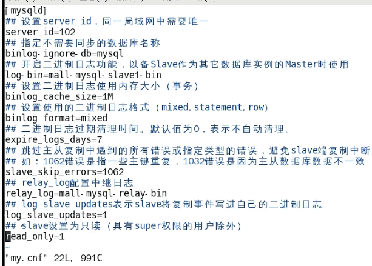
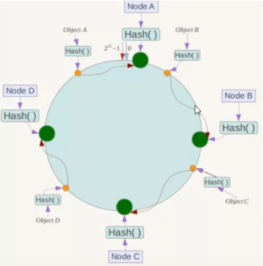
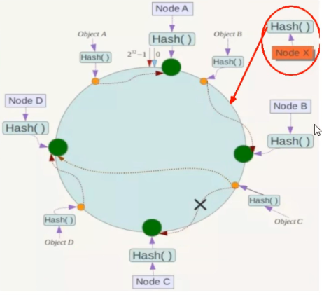
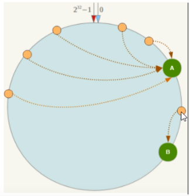

# 一、常用镜像命令

## 1.docker images	列出本地主机上的镜像

​	-a 列出所有的镜像

​	-q 镜像主键id

## 2.docker search	某个镜像的名字	查

​	--limit 数字	查询限制多少个

## 3.docker pull	某个镜像名字	拉

​	docket pull redis:6.0.8  (某个版本的redis)

## 4.docker system df	查看镜像/容器/数据卷所占空间

## 5.docker rmi	某个镜像的名字id   删除某个镜像

​	docker rmi -f  镜像id1 id2 id3

​	docker rmi  -f $(docker images -qa)   删除所有镜像 

## 6.docker ps  -a 列出所有运行的容器+历史上运行的

-l :显示最近创建的容器

-n:显示最近n个创建的容器

## 面试题： 谈谈docker虚悬镜像是什么？

答：仓库名、标签都是<none>的镜像，俗称虚悬镜像dangling image


# 二、容器使用

## 1.获取镜像

如果我们本地没有 ubuntu 镜像，我们可以使用 docker pull 命令来载入 ubuntu 镜像：

## 2.启动容器

以下命令使用 ubuntu 镜像启动一个容器，参数为以命令行模式进入该容器：

$ docker run -it ubuntu /bin/bash

**参数说明：**

--name ="容器名字"  为容器指定一个名称。

-d: 后台运行的容器并返回容器id，也即启动守护式容器（后台运行）。

-i: 交互式操作。

-t: 终端，通常与i一起使用。

ubuntu: ubuntu 镜像。

/bin/bash：放在镜像名后的是命令，这里我们希望有个交互式 Shell，因此用的是 /bin/bash。

要退出终端，直接输入 exit:

-P:随机端口映射

-p:指定端口映射

- **-a stdin:** 指定标准输入输出内容类型，可选 STDIN/STDOUT/STDERR 三项；
- **-d:** 后台运行容器，并返回容器ID；
- **-i:** 以交互模式运行容器，通常与 -t 同时使用；
- **-P:** 随机端口映射，容器内部端口**随机**映射到主机的端口
- **-p:** 指定端口映射，格式为：**主机(宿主)端口:容器端口**
- **-t:** 为容器重新分配一个伪输入终端，通常与 -i 同时使用；
- **--name="nginx-lb":** 为容器指定一个名称；
- **--dns 8.8.8.8:** 指定容器使用的DNS服务器，默认和宿主一致；
- **--dns-search example.com:** 指定容器DNS搜索域名，默认和宿主一致；
- **-h "mars":** 指定容器的hostname；
- **-e username="ritchie":** 设置环境变量；
- **--env-file=[]:** 从指定文件读入环境变量；
- **--cpuset="0-2" or --cpuset="0,1,2":** 绑定容器到指定CPU运行；
- **-m :**设置容器使用内存最大值；
- **--net="bridge":** 指定容器的网络连接类型，支持 bridge/host/none/container: 四种类型；
- **--link=[]:** 添加链接到另一个容器；
- **--expose=[]:** 开放一个端口或一组端口；
- **--volume , -v:** 绑定一个卷

## 3.后台运行

在大部分的场景下，我们希望 docker 的服务是在后台运行的，我们可以过 -d 指定容器的运行模式。

$ docker run -itd --name ubuntu-test ubuntu /bin/bash

**注：**加了 **-d** 参数默认不会进入容器，想要进入容器需要使用指令 **docker exec**（下面会介绍到）。

## 4.停止一个容器

停止容器的命令如下：$ docker stop <容器 ID>

停止的容器可以通过 docker restart 重启：$ docker restart <容器 ID>

## 5.进入容器

在使用 -d 参数时，容器启动后会进入后台。此时想要进入容器，可以通过以下指令进入：

docker attach

docker exec：推荐大家使用 docker exec 命令，因为此命令会退出容器终端，但不会导致容器的停止。

**attach 命令**

下面演示了使用 docker attach 命令。

$ docker attach 1e560fca3906 

注意： 如果从这个容器退出，会导致容器的停止。

**exec 命令**

下面演示了使用 docker exec 命令。

docker exec -it 243c32535da7 /bin/bash

## 6.导出和导入容器

**导出容器**

如果要导出本地某个容器，可以使用 docker export 命令。$ docker export 1e560fca3906 > ubuntu.tar

导出容器 1e560fca3906 快照到本地文件 ubuntu.tar。

**导入容器快照**

可以使用 docker import 从容器快照文件中再导入为镜像，以下实例将快照文件 ubuntu.tar 导入到镜像 test/ubuntu:v1:

$ cat docker/ubuntu.tar | docker import - test/ubuntu:v1

## 7.查看日志

docker logs 容器id

## 8.容器文件拷贝

docker cp 容器Id:容器内路径  目的主机路径

例：docker cp 1e560fca3906 :/usr/local/test.txt   /snh/tmp


# 三、Docker commit 命令

## 1.docker commit :从容器创建一个新的镜像。

**语法**

docker commit -m="提交的描述信息" -a="作者"  容器Id  要创建的目标镜像名:[标签名]

docker commit [OPTIONS] CONTAINER [REPOSITORY[:TAG]]

OPTIONS说明：

-a :提交的镜像作者；

-c :使用Dockerfile指令来创建镜像；

-m :提交时的说明文字；

-p :在commit时，将容器暂停。

**实例**
将容器a404c6c174a2 保存为新的镜像,并添加提交人信息和说明信息。

```
runoob@runoob:~$ docker commit -a "runoob.com" -m "my apache" a404c6c174a2  mymysql:v1 
sha256:37af1236adef1544e8886be23010b66577647a40bc02c0885a6600b33ee28057
runoob@runoob:~$ docker images mymysql:v1
REPOSITORY          TAG                 IMAGE ID            CREATED             SIZE
mymysql             v1                  37af1236adef        15 seconds ago      329 MB
```

## 2.演示Ubuntu安装vim，提交容器副本是指成为一个新的镜像

从Hub上下载Ubuntu镜像到本地并成功运行

原始的镜像不带vim命令，外网联通的情况下安装vim

```
# 先更新我们的包管理工具
apt-get update
# 然后安装我们需要的vim工具
apt-get install vim
```

安装完成后，commit我们自己的新镜像

```
# 提交容器副本，将容器a404c6c174a2 保存为新的镜像,并添加提交人信息和说明信息。
docker commit -m="add vim cmd" -a="snh"  a404c6c174a2 myvim-ubuntu
```

启动我们的新景象并和原来的对比

```
# 启动新的镜像
docker run -it a404c6c174a2 /bin/bash
```


# 四、本地镜像发布

## 1、本地镜像发布到阿里云流程图


登录阿里云；

选择控制台，进入容器镜像服务；

选择个人实例；

创建命名空间和仓库；

进入管理界面获取脚本。

```
# 1.登录阿里云docker registry
docker login --username=snh****  registry.cn-qingdao.aliyuncs.com
用于登录的用户名为阿里云账号，密码为开通时候的密码

# 2.从registry中拉去镜像
docker pull registry.cn-qingdao.aliyuncs.com/myubutu:[镜像版本号]

# 3.将镜像推送到registry
docker login --username=snh****  registry.cn-qingdao.aliyuncs.com
docker tag [镜像Id] registry.cn-qingdao.aliyuncs.com/myubutu:[镜像版本号]
docker push registry.cn-qingdao.aliyuncs.com/myubutu:[镜像版本号]
```

## 2、本地镜像发布到私有库

个人或者公司建立的私有仓库；

Docker Hub地址：https://hub.docker.com/  中国访问太慢


### 下载镜像Docker Registry

```
docker pull registry
```

**运行私有库Registry，相当于本地有个私有Docker Hub**

```
# 默认情况，仓库被创建在容器的/var/lib/registry目录下，建议自行用容器卷映射，方便宿主机联调
docker run -d -p 5000:5000 -v/snhuse/myregistry/:/tmp/registry --privileged=true registry
docker ps
```

### 案例演示创建一个新景象，Ubuntu安装ifconfig命令

```
# 同commit案例 
从Hub上下载Ubuntu镜像到本地并成功运行
原始的镜像不带ifconfig命令，外网联通的情况下安装ifconfig
# 先更新我们的包管理工具
apt-get update
# 然后安装我们需要的ifconfig工具
apt-get install net-tools
安装完成后，commit我们自己的新镜像
# 提交容器副本，将容器a404c6c174a2 保存为新的镜像,并添加提交人信息和说明信息。
docker commit -m="add ifconfig cmd" -a="snh"  a404c6c174a2 myvim-ubuntu
```

#### curl验证私服库上有什么镜像

```
# 发送一个get请求
curl -XGET http://localhost:5000/v2/_catalog
```

#### 将新镜像myubuntu:1.2 修改符合私服规范的Tag

```
# 公式： docker tag 镜像:Tag Host:Port/Repository:Tag
docker tag [镜像Id] localhost:5000/myubutu:[镜像版本号]
```

#### 修改配置文件使之支持http

```
vim /etc/docker/daemon.json
# 加入"insecure-registries":["localhost:5000"]

# 修改完成后假如不生效，就重启docker
systemctl restart docker
```

#### push推送到私服库

```
docker push ip:5000 /myubuntu:[镜像版本号]
```

#### curl验证私服库上有什么镜像

```
# 发送一个get请求
curl -XGET http://ip:5000/v2/_catalog
```

#### pull到本地并运行

```
docker images
# 删除本地镜像
docker rmi - f ip:5000/myubuntu:1.2
# 重新拉取镜像
docker pull ip:5000/myubuntu:1.2
# 运行docker
docker run -it ip:5000 /myubuntu:1.2 /bin/bash
```


# 五、docker容器数据卷

## 1、遇到的坑：容器卷记得加入

--privileged=true

Docker挂载主机目录访问如果出现ccannot open directory ...Permission denied

解决办法：在挂载目录后多加一个--privileged=true参数即可。

## 2、是什么

卷就是目录或者文件，存在于一个或者多个容器中，由docker挂载到容器，但不属于联合文件系统，一次能够绕过

Union File System提供一些用于持续存储或共享数据的特性；

卷的设计目的就是数据的持久化，完全都有利于容器的生命周期，因此docker不会在容器删除时删除其挂载的数据卷。

**运行一个带有容器卷存储功能的容器实例**

```
docker run -it --privileged=true  -v/宿主机绝对路径目录:/容器内目录  镜像名
```

将容器内的数据备份存储到宿主机的目录下面

## 3、能干嘛

将运用于运行的环境打包镜像，run后形成容器实例运行，但是我们对数据的要求希望是持久化的，docker容器产生的数

据，如果不备份，那么当容器实例删除后，容器内的数据自然也就没有了，为了能保存数据在docker中，我们使用卷。

## 4、特点

1. 数据卷可在容器之间共享或重用数据
2. 卷中的更改可以直接实时生效
3. 数据卷中的更改不会包含在镜像的更新中
4. 数据卷的生命周期一直持续到没有容器使用它为止

## 5、容器卷案例

**命令**

```
 docker run -it --privileged=true  -v/宿主机绝对路径目录:/容器内目录  镜像名
```

**查看数据卷是否挂载成功**

```
# 查看运行的实例
dokcer ps
# 查看容器内版本属性信息，可以查看挂载绑定信息
docker inspect 容器Id
```

**容器和宿主机之间数据共享**

- docker修改，主机同步获得
- 主机修改，docker同伙获得
- docker容器stop，主机修改，docker容器重启后数据依然同步。

## 6、容器卷ro和rw读写规则

**读写（默认）rw=read and write**

```
# 容器卷rw，可读可写
docker run -it --privileged=true  -v/宿主机绝对路径目录:/容器内目录:rw  镜像名
默认同上案例，默认就是rw可读可写的
```

**只能读 ro=read only**

```
# 容器卷ro，只能读不能写
docker run -it --privileged=true  -v/宿主机绝对路径目录:/容器内目录:ro 镜像名
```

## 7、卷的继承和共享

**容器1完成和宿主机的映射**

```
# 容器u1可读可写，在/tmp/u目录下
docker run -it --privileged=true  -v/mydocker/u:/tmp/u --name u1 ubuntu /bin/bash
```

**容器2继承容器1的卷规则**

**docker run -it --privileged=true --volumes-from 父类 --name u2 ubuntu**

```
# 容器u2继承容器u1的卷规则
docker run -it --privileged=true --volumes-from u1 --name u2 ubuntu
```


# 六、docker上安装常用软件

## 总体步骤

1. 搜索镜像
2. 拉取镜像
3. 查看镜像
4. 启动该镜像
5. 停止容器
6. 移除容器

## 1、安装tomcat

### **方法一、docker pull tomcat**

#### 查找 [Docker Hub](https://hub.docker.com/_/tomcat?tab=tags) 上的 Tomcat 镜像

可以通过 Sort by 查看其他版本的 tomcat，默认是最新版本 **tomcat:latest**。

此外，我们还可以在控制台使用 **docker search tomcat** 命令来查看可用版本：

```
runoob@runoob:~/tomcat$ docker search tomcat
NAME                       DESCRIPTION                                     STARS     OFFICIAL   AUTOMATED
tomcat                     Apache Tomcat is an open source implementa...   744       [OK]       
dordoka/tomcat             Ubuntu 14.04, Oracle JDK 8 and Tomcat 8 ba...   19                   [OK]
consol/tomcat-7.0          Tomcat 7.0.57, 8080, "admin/admin"              16                   [OK]
consol/tomcat-8.0          Tomcat 8.0.15, 8080, "admin/admin"              14                   [OK]
cloudesire/tomcat          Tomcat server, 6/7/8                            8                    [OK]
davidcaste/alpine-tomcat   Apache Tomcat 7/8 using Oracle Java 7/8 wi...   6                    [OK]
andreptb/tomcat            Debian Jessie based image with Apache Tomc...   4                    [OK]
kieker/tomcat                                                              2                    [OK]
fbrx/tomcat                Minimal Tomcat image based on Alpine Linux      2                    [OK]
jtech/tomcat               Latest Tomcat production distribution on l...   1                    [OK]
```

#### 拉取官方的镜像：

```
runoob@runoob:~/tomcat$ docker pull tomcat
```

等待下载完成后，我们就可以在本地镜像列表里查到 REPOSITORY 为 tomcat 的镜像。

```
runoob@runoob:~/tomcat$ docker images|grep tomcat
tomcat              latest              70f819d3d2d9        7 days ago          335.8 MB
```

### **方法二、通过 Dockerfile 构建**

#### **创建Dockerfile**

**首先，创建目录tomcat,用于存放后面的相关东西。**

```
runoob@runoob:~$ mkdir -p ~/tomcat/webapps ~/tomcat/logs ~/tomcat/conf
```

**webapps 目录将映射为 tomcat 容器配置的应用程序目录。**

**logs 目录将映射为 tomcat 容器的日志目录。**

**conf 目录里的配置文件将映射为 tomcat 容器的配置文件。**

**进入创建的 tomcat 目录，创建 Dockerfile。**

```
FROM openjdk:8-jre

ENV CATALINA_HOME /usr/local/tomcat
ENV PATH $CATALINA_HOME/bin:$PATH
RUN mkdir -p "$CATALINA_HOME"
WORKDIR $CATALINA_HOME

# let "Tomcat Native" live somewhere isolated
ENV TOMCAT_NATIVE_LIBDIR $CATALINA_HOME/native-jni-lib
ENV LD_LIBRARY_PATH ${LD_LIBRARY_PATH:+$LD_LIBRARY_PATH:}$TOMCAT_NATIVE_LIBDIR

# runtime dependencies for Tomcat Native Libraries
# Tomcat Native 1.2+ requires a newer version of OpenSSL than debian:jessie has available
# > checking OpenSSL library version >= 1.0.2...
# > configure: error: Your version of OpenSSL is not compatible with this version of tcnative
# see http://tomcat.10.x6.nabble.com/VOTE-Release-Apache-Tomcat-8-0-32-tp5046007p5046024.html (and following discussion)
# and https://github.com/docker-library/tomcat/pull/31
ENV OPENSSL_VERSION 1.1.0f-3+deb9u2
RUN set -ex; \
    currentVersion="$(dpkg-query --show --showformat '${Version}\n' openssl)"; \
    if dpkg --compare-versions "$currentVersion" '<<' "$OPENSSL_VERSION"; then \
        if ! grep -q stretch /etc/apt/sources.list; then \
# only add stretch if we're not already building from within stretch
            { \
                echo 'deb http://deb.debian.org/debian stretch main'; \
                echo 'deb http://security.debian.org stretch/updates main'; \
                echo 'deb http://deb.debian.org/debian stretch-updates main'; \
            } > /etc/apt/sources.list.d/stretch.list; \
            { \
# add a negative "Pin-Priority" so that we never ever get packages from stretch unless we explicitly request them
                echo 'Package: *'; \
                echo 'Pin: release n=stretch*'; \
                echo 'Pin-Priority: -10'; \
                echo; \
# ... except OpenSSL, which is the reason we're here
                echo 'Package: openssl libssl*'; \
                echo "Pin: version $OPENSSL_VERSION"; \
                echo 'Pin-Priority: 990'; \
            } > /etc/apt/preferences.d/stretch-openssl; \
        fi; \
        apt-get update; \
        apt-get install -y --no-install-recommends openssl="$OPENSSL_VERSION"; \
        rm -rf /var/lib/apt/lists/*; \
    fi

RUN apt-get update && apt-get install -y --no-install-recommends \
        libapr1 \
    && rm -rf /var/lib/apt/lists/*

# see https://www.apache.org/dist/tomcat/tomcat-$TOMCAT_MAJOR/KEYS
# see also "update.sh" (https://github.com/docker-library/tomcat/blob/master/update.sh)
ENV GPG_KEYS 05AB33110949707C93A279E3D3EFE6B686867BA6 07E48665A34DCAFAE522E5E6266191C37C037D42 47309207D818FFD8DCD3F83F1931D684307A10A5 541FBE7D8F78B25E055DDEE13C370389288584E7 61B832AC2F1C5A90F0F9B00A1C506407564C17A3 713DA88BE50911535FE716F5208B0AB1D63011C7 79F7026C690BAA50B92CD8B66A3AD3F4F22C4FED 9BA44C2621385CB966EBA586F72C284D731FABEE A27677289986DB50844682F8ACB77FC2E86E29AC A9C5DF4D22E99998D9875A5110C01C5A2F6059E7 DCFD35E0BF8CA7344752DE8B6FB21E8933C60243 F3A04C595DB5B6A5F1ECA43E3B7BBB100D811BBE F7DA48BB64BCB84ECBA7EE6935CD23C10D498E23

ENV TOMCAT_MAJOR 8
ENV TOMCAT_VERSION 8.5.32
ENV TOMCAT_SHA512 fc010f4643cb9996cad3812594190564d0a30be717f659110211414faf8063c61fad1f18134154084ad3ddfbbbdb352fa6686a28fbb6402d3207d4e0a88fa9ce

ENV TOMCAT_TGZ_URLS \
# https://issues.apache.org/jira/browse/INFRA-8753?focusedCommentId=14735394#comment-14735394
    https://www.apache.org/dyn/closer.cgi?action=download&filename=tomcat/tomcat-$TOMCAT_MAJOR/v$TOMCAT_VERSION/bin/apache-tomcat-$TOMCAT_VERSION.tar.gz \
# if the version is outdated, we might have to pull from the dist/archive :/
    https://www-us.apache.org/dist/tomcat/tomcat-$TOMCAT_MAJOR/v$TOMCAT_VERSION/bin/apache-tomcat-$TOMCAT_VERSION.tar.gz \
    https://www.apache.org/dist/tomcat/tomcat-$TOMCAT_MAJOR/v$TOMCAT_VERSION/bin/apache-tomcat-$TOMCAT_VERSION.tar.gz \
    https://archive.apache.org/dist/tomcat/tomcat-$TOMCAT_MAJOR/v$TOMCAT_VERSION/bin/apache-tomcat-$TOMCAT_VERSION.tar.gz

ENV TOMCAT_ASC_URLS \
    https://www.apache.org/dyn/closer.cgi?action=download&filename=tomcat/tomcat-$TOMCAT_MAJOR/v$TOMCAT_VERSION/bin/apache-tomcat-$TOMCAT_VERSION.tar.gz.asc \
# not all the mirrors actually carry the .asc files :'(
    https://www-us.apache.org/dist/tomcat/tomcat-$TOMCAT_MAJOR/v$TOMCAT_VERSION/bin/apache-tomcat-$TOMCAT_VERSION.tar.gz.asc \
    https://www.apache.org/dist/tomcat/tomcat-$TOMCAT_MAJOR/v$TOMCAT_VERSION/bin/apache-tomcat-$TOMCAT_VERSION.tar.gz.asc \
    https://archive.apache.org/dist/tomcat/tomcat-$TOMCAT_MAJOR/v$TOMCAT_VERSION/bin/apache-tomcat-$TOMCAT_VERSION.tar.gz.asc

RUN set -eux; \
    \
    savedAptMark="$(apt-mark showmanual)"; \
    apt-get update; \
    \
    apt-get install -y --no-install-recommends gnupg dirmngr; \
    \
    export GNUPGHOME="$(mktemp -d)"; \
    for key in $GPG_KEYS; do \
        gpg --keyserver ha.pool.sks-keyservers.net --recv-keys "$key"; \
    done; \
    \
    apt-get install -y --no-install-recommends wget ca-certificates; \
    \
    success=; \
    for url in $TOMCAT_TGZ_URLS; do \
        if wget -O tomcat.tar.gz "$url"; then \
            success=1; \
            break; \
        fi; \
    done; \
    [ -n "$success" ]; \
    \
    echo "$TOMCAT_SHA512 *tomcat.tar.gz" | sha512sum -c -; \
    \
    success=; \
    for url in $TOMCAT_ASC_URLS; do \
        if wget -O tomcat.tar.gz.asc "$url"; then \
            success=1; \
            break; \
        fi; \
    done; \
    [ -n "$success" ]; \
    \
    gpg --batch --verify tomcat.tar.gz.asc tomcat.tar.gz; \
    tar -xvf tomcat.tar.gz --strip-components=1; \
    rm bin/*.bat; \
    rm tomcat.tar.gz*; \
    rm -rf "$GNUPGHOME"; \
    \
    nativeBuildDir="$(mktemp -d)"; \
    tar -xvf bin/tomcat-native.tar.gz -C "$nativeBuildDir" --strip-components=1; \
    apt-get install -y --no-install-recommends \
        dpkg-dev \
        gcc \
        libapr1-dev \
        libssl-dev \
        make \
        "openjdk-${JAVA_VERSION%%[.~bu-]*}-jdk=$JAVA_DEBIAN_VERSION" \
    ; \
    ( \
        export CATALINA_HOME="$PWD"; \
        cd "$nativeBuildDir/native"; \
        gnuArch="$(dpkg-architecture --query DEB_BUILD_GNU_TYPE)"; \
        ./configure \
            --build="$gnuArch" \
            --libdir="$TOMCAT_NATIVE_LIBDIR" \
            --prefix="$CATALINA_HOME" \
            --with-apr="$(which apr-1-config)" \
            --with-java-home="$(docker-java-home)" \
            --with-ssl=yes; \
        make -j "$(nproc)"; \
        make install; \
    ); \
    rm -rf "$nativeBuildDir"; \
    rm bin/tomcat-native.tar.gz; \
    \
# reset apt-mark's "manual" list so that "purge --auto-remove" will remove all build dependencies
    apt-mark auto '.*' > /dev/null; \
    [ -z "$savedAptMark" ] || apt-mark manual $savedAptMark; \
    apt-get purge -y --auto-remove -o APT::AutoRemove::RecommendsImportant=false; \
    rm -rf /var/lib/apt/lists/*; \
    \
# sh removes env vars it doesn't support (ones with periods)
# https://github.com/docker-library/tomcat/issues/77
    find ./bin/ -name '*.sh' -exec sed -ri 's|^#!/bin/sh$|#!/usr/bin/env bash|' '{}' +

# verify Tomcat Native is working properly
RUN set -e \
    && nativeLines="$(catalina.sh configtest 2>&1)" \
    && nativeLines="$(echo "$nativeLines" | grep 'Apache Tomcat Native')" \
    && nativeLines="$(echo "$nativeLines" | sort -u)" \
    && if ! echo "$nativeLines" | grep 'INFO: Loaded APR based Apache Tomcat Native library' >&2; then \
        echo >&2 "$nativeLines"; \
        exit 1; \
    fi

EXPOSE 8080
CMD ["catalina.sh", "run"]
```

通过 Dockerfile 创建一个镜像，替换成你自己的名字：

```
runoob@runoob:~/tomcat$ docker build -t tomcat
```

创建完成后，我们可以在本地的镜像列表里查找到刚刚创建的镜像：

```
runoob@runoob:~/tomcat$ docker images|grep tomcat
tomcat              latest              70f819d3d2d9        7 days ago          335.8 MB
```

### 使用 tomcat 镜像

#### **运行容器**

```
runoob@runoob:~/tomcat$ docker run --name tomcat -p 8080:8080 -v $PWD/test:/usr/local/tomcat/webapps/test -d tomcat  
acb33fcb4beb8d7f1ebace6f50f5fc204b1dbe9d524881267aa715c61cf75320
runoob@runoob:~/tomcat$
```

命令说明：

**-p 8080:8080：**将主机的 8080 端口映射到容器的 8080 端口。

**-v $PWD/test:/usr/local/tomcat/webapps/test：**将主机中当前目录下的 test 挂载到容器的 /test。

#### **查看容器启动情况**

```
runoob@runoob:~/tomcat$ docker ps 
CONTAINER ID    IMAGE     COMMAND               ... PORTS                    NAMES
acb33fcb4beb    tomcat    "catalina.sh run"     ... 0.0.0.0:8080->8080/tcp   tomcat
```


## 2、安装mysql

### **查看可用的 MySQL 版本**

访问 MySQL 镜像库地址：https://hub.docker.com/_/mysql?tab=tags 。

可以通过 Sort by 查看其他版本的 MySQL，默认是最新版本 mysql:latest 。

此外，我们还可以用 **docker search mysql** 命令来查看可用版本：

```
$ docker search mysql
NAME                     DESCRIPTION                                     STARS     OFFICIAL   AUTOMATED
mysql                    MySQL is a widely used, open-source relati...   2529      [OK]       
mysql/mysql-server       Optimized MySQL Server Docker images. Crea...   161                  [OK]
centurylink/mysql        Image containing mysql. Optimized to be li...   45                   [OK]
sameersbn/mysql                                                          36                   [OK]
google/mysql             MySQL server for Google Compute Engine          16                   [OK]
appcontainers/mysql      Centos/Debian Based Customizable MySQL Con...   8                    [OK]
marvambass/mysql         MySQL Server based on Ubuntu 14.04              6                    [OK]
drupaldocker/mysql       MySQL for Drupal                                2                    [OK]
azukiapp/mysql           Docker image to run MySQL by Azuki - http:...   2                    [OK]
...
```

### **拉取 MySQL 镜像**

```
#这里我们拉取官方的最新版本的镜像：
$ docker pull mysql:latest
```

### **查看本地镜像**

```
#使用以下命令来查看是否已安装了 mysql：
$ docker images
```

### **运行容器**

```
$ docker run -itd --name mysql-test -p 3306:3306 -e MYSQL_ROOT_PASSWORD=123456 mysql
```

参数说明：

- **-p 3306:3306** ：映射容器服务的 3306 端口到宿主机的 3306 端口，外部主机可以直接通过 **宿主机ip:3306** 访问到 MySQL 的服务。
- **MYSQL_ROOT_PASSWORD=123456**：设置 MySQL 服务 root 用户的密码。

### **安装成功**

通过 **docker ps** 命令查看是否安装成功。

本机可以通过 root 和密码 123456 访问 MySQL 服务。

### **docker 安装 mysql 8 版本**

```
# docker 中下载 mysql
docker pull mysql

#启动
docker run --name mysql -p 3306:3306 -e MYSQL_ROOT_PASSWORD=Lzslov123! -d mysql

#进入容器
docker exec -it mysql bash

#登录mysql
mysql -u root -p
ALTER USER 'root'@'localhost' IDENTIFIED BY 'Lzslov123!';

#添加远程登录用户
CREATE USER 'liaozesong'@'%' IDENTIFIED WITH mysql_native_password BY 'Lzslov123!';
GRANT ALL PRIVILEGES ON *.* TO 'liaozesong'@'%';
```


## 3、安装redis

### 查看可用的 Redis 版本

访问 Redis 镜像库地址： https://hub.docker.com/_/redis?tab=tags。

可以通过 Sort by 查看其他版本的 Redis，默认是最新版本 **redis:latest**。

此外，我们还可以用 **docker search redis** 命令来查看可用版本：

```
$ docker search  redis
NAME                      DESCRIPTION                   STARS  OFFICIAL  AUTOMATED
redis                     Redis is an open source ...   2321   [OK]       
sameersbn/redis                                         32                   [OK]
torusware/speedus-redis   Always updated official ...   29             [OK]
bitnami/redis             Bitnami Redis Docker Image    22                   [OK]
anapsix/redis             11MB Redis server image ...   6                    [OK]
webhippie/redis           Docker images for redis       4                    [OK]
clue/redis-benchmark      A minimal docker image t...   3                    [OK]
williamyeh/redis          Redis image for Docker        3                    [OK]
unblibraries/redis        Leverages phusion/baseim...   2                    [OK]
greytip/redis             redis 3.0.3                   1                    [OK]
servivum/redis            Redis Docker Image            1                    [OK]
...
```

### 取最新版的 Redis 镜像

这里我们拉取官方的最新版本的镜像：

```
$ docker pull redis:latest
```

### 查看本地镜像

使用以下命令来查看是否已安装了 redis：

```
$ docker images
```

### 运行容器

安装完成后，我们可以使用以下命令来运行 redis 容器：

```
$ docker run -itd --name redis-test -p 6379:6379 redis
```

参数说明：

- **-p 6379:6379**：映射容器服务的 6379 端口到宿主机的 6379 端口。外部可以直接通过宿主机ip:6379 访问到 Redis 的服务。

### 安装成功

最后我们可以通过 **docker ps** 命令查看容器的运行信息

接着我们通过 redis-cli 连接测试使用 redis 服务。

```
$ docker exec -it redis-test /bin/bash
```


## 4、安装Nginx

### 查看可用的 Nginx 版本

访问 Nginx 镜像库地址： https://hub.docker.com/_/nginx?tab=tags。

可以通过 Sort by 查看其他版本的 Nginx，默认是最新版本 **nginx:latest**。

此外，我们还可以用 **docker search nginx** 命令来查看可用版本：

```
$ docker search nginx
NAME                      DESCRIPTION                                     STARS     OFFICIAL   AUTOMATED
nginx                     Official build of Nginx.                        3260      [OK]       
jwilder/nginx-proxy       Automated Nginx reverse proxy for docker c...   674                  [OK]
richarvey/nginx-php-fpm   Container running Nginx + PHP-FPM capable ...   207                  [OK]
million12/nginx-php       Nginx + PHP-FPM 5.5, 5.6, 7.0 (NG), CentOS...   67                   [OK]
maxexcloo/nginx-php       Docker framework container with Nginx and ...   57                   [OK]
...
```

### 取最新版的 Nginx 镜像

这里我们拉取官方的最新版本的镜像：

```
$ docker pull nginx:latest
```

### 查看本地镜像

使用以下命令来查看是否已安装了 nginx：

```
$ docker images
```

### 运行容器

安装完成后，我们可以使用以下命令来运行 nginx 容器：

```
$ docker run --name nginx-test -p 8080:80 -d nginx
```

参数说明：

- **--name nginx-test**：容器名称。
- **-p 8080:80**： 端口进行映射，将本地 8080 端口映射到容器内部的 80 端口。
- **-d nginx**： 设置容器在在后台一直运行。

### 安装成功

最后我们可以通过浏览器可以直接访问 8080 端口的 nginx 服务


# 七、docker复杂安装

## 安装mysql主从复制

### 1、主从复制原理

### 2、主从搭建步骤

1. **新建主服务器容器3307**

  ```
# 创建一个新的容器
docker -run -p 3307:3306 --name mysql-master
# 绑定一个容器卷
-v /mydata/mysql-master/log：/var/log/mysql
-v /mydata/mysql-master/data:/var/lib/mysql
-v /mydata/mysql-master/conf:/etc/mysql
-e MYSQL_ROOT_PASSWORD=root
-d mysql:5.7
  ```

2. **进入/mydata/mysql-master/conf 目录下新建my.cnf**

   

3. **修改完重启mysql-master容器**

   ```
   docker restart mysql-master
   ```

4. **进入mysql-master容器**

   ```
   docker exec -it mysql-master /bin/bash
   mysql -uroot -proot
   ```

5. **master容器实例内创建数据同步用户**

   ```
   # 创建slave用户，密码123456
   CREATE USER'slave'@'%'IDENTIFIED BY'123456';
   # 授权
   GRANT REPLICATION SLAVE,REPLICATION CLIENT ON *.* TO 'slave'@'%'
   ```

6. **新建从服务器容器3308**

   ```
   # 创建一个新的容器
   docker -run -p 3308:3306 --name mysql-slave
   # 绑定一个容器卷
   -v /mydata/mysql-slave/log：/var/log/mysql
   -v /mydata/mysql-slave/data:/var/lib/mysql
   -v /mydata/mysql-slave/conf:/etc/mysql
   -e MYSQL_ROOT_PASSWORD=root
   -d mysql:5.7
   ```

7. **进入/mydata/mysql-slave/conf 目录下新建my.cnf**

   

8. **修改完配置后重启slave实例**

   ```
   docker restart mysql-slave
   ```

9. **在主数据库中查看主从同步状态**

   ```
   show master status
   ```

10. **进入mysql-slave容器**

    ```
    docker exec -it mysql-slave /bin/bash
    mysql -uroot -proot
    ```

11. **在从数据库中配置主从复制**

    ```
    change master to master_host='宿主机ip',master_user='slave',master_password='123456',
    master_port=3307,master_log_file='mall-mysql-bin.000001',master_log_pos=617,
    master_connect_retry=30;
    ```

    **主从复制命令参数说明**

    master_host:主数据库的IP地址;

    master_port:主数据库的运行端口;

    master_user:在主数据库创建的用于同步数据的用户账号;

    master_password:在主数据库创建的用于同步数据的用户密码;

    master_log_file:指定从数据库要复制数据的日志文件,T通过查看主数据的状态，获取File参数;

    master_log_pos:指定从数据库从哪个位置开始复制数据，通过查看主数据的状态，获取Position参数;

    master_connect_retry:连接失败重试的时间间隔，单位为秒。

12. **在从数据库中查看主从同步状态**

    ```
    # \G 展示k，v键值对
    show slave status \G;
    ```

13. **在从数据库中开启主从同步**

    ```
    start slave
    ```

14. **查看从数据库发现已经同步**

    ```
    show slave status \G"
    ```

15. **主从复制测试**


## 安装redis集群

cluster（集群）模式-dokcer版本 ，哈希槽分区进行亿级数据存储

### **面试题**

1~2亿条数据需要缓存，请问如何设计这个存储案例？

**答：**

单机单台100%不可能，肯定是分布式存储，如何用redis实现？

### **三种方案**

#### 一、哈希取余分区

2亿条记录就是2亿个kv，我们单机不行必须要分布式多机，假设有3台机器构成一个集群，用户每次读写操作都是根据公式:hash(key)%N个机器台数，计算出哈希值，用来决定数据映射到哪一个节点上。

##### **优点**

简单相暴，直接有效，只需要预估好数据规划好节点，例如3台、8台、10台，就能保证一段时间的数据支撑。使用Hash算法让固定的一部分清求落到同一台服务器上，这样每台服务器固定处理一部分请求（并维护这些请求的信息)，起到负载均衡+分而治之的作用。

##### **缺点**

原来规划好的节点，进行扩容或者缩容就比较麻烦了额，不管扩缩，每次数据变动导致节点有变动，映射关系需要重新进行计算，在服务器个数固定不变时没有问题，如果需要弹性扩容或故障停机的情况下，原来的取模公式就会发生变化:Hash(key/3会变成Hash(key) 2。此时地址经过取余运算的结果将发生很大变化，根据公式获取的服务器也会变得不可控。假如某个redis机器宕机了，由于台数数量变化，会导致hash取余全部数据重新洗牌。

#### **二、一致性哈希算法分区**

##### 是什么

一致性哈希算法在1997年由麻省理工学院中提出的，设计目标是为了解决分布式缓存数据变动和映射问题，某个机器宕机了，分母数量改变了，自然取余数不OK了。

##### 能干嘛

提出一致性Hash解决方案。目的是当服务器个数发生变动时，尽量减少影响客户端到服务器的映射关系。

##### **3大步骤**

- **算法构建一致性哈希环**

  一致性哈希算法必然有个hash函数并按照算法产生hash值，这个算法的所有可能哈希值会构成一个全量集，这个集合可以成为一个hash空间[0.2^32-1]，这个是一个线性空间，但是在算法中，我们通过适当的逻辑控制将它首尾相连(0=2^32),这样让它逻辑上形成了一个环形空间。

  它也是按照使用取模的方法，前面笔记介绍的节点取模法是对节点（服务器）的数量进行取模。而一致性Hash算法是对2*32取模，简单来说，一致性Hash算法将整个哈希值空间组织成一个虚拟的圆环，如假设某哈希函数H的值空间为0-2^32-1(即哈希值是一个32位无符号整形），整个哈希环如下图。整个空间按顺时针方向组织，圆环的正上方的点代表0，O点右侧的第一个点代表1，以此类推，2、3、4、……直到2^32-1，也就是说O点左侧的第一个点代表2^32-1，0和2^32-1在零点中方向重合，我们把这个由2^32个点组成的圆环称为Hash环。

- **服务器lp节点映射**

  将集群中各个IP节点映射到环上的某一个位置。

  将各个服务器使用Hash进行一个哈希，具体可以选择服务器的IP或主机名作为关键字进行哈希，这样每台机器就能确定其在哈希环上的位置。假如4个节点NodeA、B、C、D，经过IP地址的哈希函数计算(hash(ip))，使用IP地址哈希后在环空间的位置如下:

  

- **key落到服务器的落键规则**

  当我们需要存储一个kv键值对时，首先计算keyi的hash值， hash(key)，将这个key使用相同的函数Hashi计算出哈希值并确定此数据在环上的位置，从此位置沿环顺时针“行走”，第一台遇到的服务器就是其应该定位到的服务器，并将该键值对存储在该节点上。

  如我们有Object A、ObjectB、Object C、 Object D四个数据对象，经过哈希计算后，在环空间上的位置如下。根据一致性Hash算法，数据A会被定为到Node A上，B被定为到Node B上，C被定为到Node C上，D被定为到Node D上。

  

  ##### 优点

  **容错性：**

  假设NodeC宕机，可以看到此时对象A、B、D不会受到影响，只有C对象被重定位到Node D。一般的，在一致性Hash算法中，如果一台服务器不可用，则受影响的数据仅仅是此服务器到其环空间中前一台服务器(即沿着逆时针方向行走遇到的第一台服务器〉之间数据，其它不会受到影响。简单说，就是C挂了，受到影响的只是B、C之间的数据，并且这些数据会转移到D进行存储。

  

  **扩展性：**

  数据量增加了，需要增加一台节点Nodex，X的位置在A和B之间，那收到影响的也就是A到X之间的数据，重新把A到X的数据录入到X上即可，不会导致hash取余全部数据重新洗牌。

  

  ##### 缺点

  **Hash环的数据倾斜问题**

  一致性Hash算法在服务节点太少时，容易因为节点分布不均匀而造成数据倾斜（被缓存的对象大部分集中缓存在某一台服务器上)问题.例如系统中只有两台服务器:

  

#### 三、哈希槽分区

##### 是什么

哈希槽实质就是一个数组，数组[0,2^14-1]形成hash slot空间。

##### 能干什么

解决均匀分配的问题，在数据和节点之间又加入了一层，把这层称为哈希槽(slot)，用于管理数据和节点之间的关系，现在就相当于节点上放的是槽，槽里放的是数据。l

槽解决的是粒度问题，相当于把粒度变大了，这样便于数据移动。

哈希解决的是映射问题，使用key的哈希值来计算所在的槽，便于数据分配。

##### 多少个哈希槽

一个集群只能有16384个槽，编号0-16,383(0-2^14-1)。这些槽会分配给集群中的所有主节点，分配策略没有要求。可以指定哪些编号的槽分配给哪个主节点。集群会记录节点和槽的对应关系。解决了节点和槽的关系后，接下来就需要对key求哈希值，然后对16384取余，余数是几key就落入对应的槽里。slot=CRC16(key) % 16384。以槽为单位移动数据，因为槽的数目是固定的，处理起来比较容易，这样数据移动问题就解决了。

##### 哈希槽计算

Redis集群中内置了16384个哈希槽，redis 会根据节点数量大致均等的将哈希槽映射到不同的节点。当需要在Redis 集群中放置一个key-valul时，redis先对key使用crc16算法算出一个结果，然后把结果对16384求余数，这样每个key都会对应一个编号在0-16383之间的哈希槽:也就是映射到某个节点上。如下代码，key之A、B在Node2， key之C落在Node3上。


### 3主3从redis集群配置搭建

3主3从redis集群配置

1. **关闭防火墙+启动docker后台服务**

2. **新建6个docker容器实例—命令分步解释**

   ```
   docker run -d --name redis-node-1 --net host --prvileged=true-v data/redis/share/redis-node-1:/data redis6.0.8 --cluster-enabled yes -appendonly yes --pot6381
   ```

3. **进入容器redis-node-1并为6台机器构建集群关系**

   ```
   #进入容器
   docker exec -it redis-node-1 /bin/bash
   #构建主从关系，3主3从
   redis-cli --cluster create 192.168.111.147:6381 192.168.111.147:6382 192.168.111.147:6383 192.168.111.147:6384192.168.111.147:6385 192.168.111.147:6386 --cluster-replicas 1
   ```

4. **链接进入6381作为切入点，查看集群状态**

   ```
   #进入6381
   redis -cli -p 6381
   
   #查看集群节点信息，以及挂载信息
   cluster nodes
   ```


#### 主从容错切换迁移案例

**数据读写存储**

```
#防止路由失效，需要加参数-c
redis -cli -p 6381 -c
set k1 v1
```

**查看集群信息**

```
redis -cli --cluster check 192.168.111.147:6381
```

**容错切换迁移，1号主机宕机，4号从机上位**

```
#停掉1号
docker stop redis-node-1
#以2号进入
docker exec -it redis-node-2 /bin/bash

redis -cli -p 6382 -c
#查看集群节点信息，以及挂载信息
cluster nodes
```

6381宕机了，6384上位成为了新的master。

每次案例下面挂的从机以实际情况为准，具体是几号机器就是几号。

**1号主机恢复后，为4号的从机。如果要还原需要先停掉4号，再恢复4号**


#### 主从扩容案例

**升级为4主4从：**

1. 新建6387、6388两个节点+新建后启动+查看是否8节点，进入6387容器实例内部

   ```
   docker exec -it redis-node-7 /bin/bash
   ```

2. 将新增的6387节点(空槽号)作为master节点加入原集群

   **redis-cli --cluster add-node 自己实际IP地址:6387 自己实际IP地址:6381 **

   ```
   #6387就是将要作为master新增节点
   #redis-cli --cluster add-node 自己实际IP地址:6387 自己实际IP地址:6381 
   #6381就是原来集群节点里面的领路人，相当于6387拜拜6381的码头从而找到组织加入集群
   redis-cli --cluster add-node 192.168.111.147:6387 192.168.111.147:6381 
   ```

3. 检查集群情况第1次

   ```
   redis -cli --cluster check 192.168.111.147:6381
   ```

4. 重新分派槽号

   **从之前的三台主机的槽位中都匀一点出来给到新主机**

   **命令:redis-cli --cluster reshard IP地址:端口号 **

   ```
   redis-cli --cluster reshard 192.168.111.147:6381
   ```

5. 检查集群情况第2次

6. 为主节点6387分配从节点6388

   **命令: redis-cli --cluster add-node ip:新slave端口  ip:新master端口--cluster-slave  --cluster-master-id新主机节点IlD**

   ```
   redis-cli --cluster add-node 192.168.111.147:6388 192.168.111.147:6387 --cluster-slave --cluster-master-id e4781f644d4a4e4d4b4d107157b9ba8144631451 
   ------这个是6387的编号，按照自己实际情况
   ```

7. 检查集群情况第3次团


#### 主从缩容案例

**删除6387、6388，缩容为3主3从**

1. 检查集群情况1获得6388的节点ID，并将6388删除

   **命令: redis-cli --cluster del-node ip:从机端口从机6388节点ID**

   ```
   # 获取集群信息
   redis -cli --cluster check 192.168.111.147:6382
   # 删除从机6388
   redis-cli--cluster del-node 192.168.111.147.6388 5d14907457e57b802287d1797a874ed7a1a284a8
   ```

2. 将6387的槽号清空，重新分配，本例将清出来的槽号都给6381

   ```
   # 由6381节点id来接手空出来的槽号
   redis-cli --cluster reshard 192.168.111.147:6381  
   ```

3. 检查集群情况第二次

4. 将6387删除

5. 检查集群情况第三次
