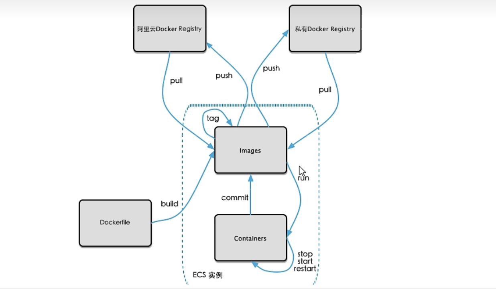

# 本地镜像发布

## 1、本地镜像发布到阿里云流程图


登录阿里云；

选择控制台，进入容器镜像服务；

选择个人实例；

创建命名空间和仓库；

进入管理界面获取脚本。

```
# 1.登录阿里云docker registry
docker login --username=snh****  registry.cn-qingdao.aliyuncs.com
用于登录的用户名为阿里云账号，密码为开通时候的密码

# 2.从registry中拉去镜像
docker pull registry.cn-qingdao.aliyuncs.com/myubutu:[镜像版本号]

# 3.将镜像推送到registry
docker login --username=snh****  registry.cn-qingdao.aliyuncs.com
docker tag [镜像Id] registry.cn-qingdao.aliyuncs.com/myubutu:[镜像版本号]
docker push registry.cn-qingdao.aliyuncs.com/myubutu:[镜像版本号]
```


## 2、本地镜像发布到私有库

个人或者公司建立的私有仓库；

Docker Hub地址：https://hub.docker.com/  中国访问太慢



### 下载镜像Docker Registry

```
docker pull registry
```

### 运行私有库Registry，相当于本地有个私有Docker Hub

```
# 默认情况，仓库被创建在容器的/var/lib/registry目录下，建议自行用容器卷映射，方便宿主机联调
docker run -d -p 5000:5000 -v/snhuse/myregistry/:/tmp/registry --privileged=true registry
docker ps
```

### 案例演示创建一个新景象，Ubuntu安装ifconfig命令

```
# 同commit案例 
从Hub上下载Ubuntu镜像到本地并成功运行
原始的镜像不带ifconfig命令，外网联通的情况下安装ifconfig
# 先更新我们的包管理工具
apt-get update
# 然后安装我们需要的ifconfig工具
apt-get install net-tools
安装完成后，commit我们自己的新镜像
# 提交容器副本，将容器a404c6c174a2 保存为新的镜像,并添加提交人信息和说明信息。
docker commit -m="add ifconfig cmd" -a="snh"  a404c6c174a2 myvim-ubuntu
```

#### curl验证私服库上有什么镜像

```
# 发送一个get请求
curl -XGET http://localhost:5000/v2/_catalog
```

#### 将新镜像myubuntu:1.2 修改符合私服规范的Tag

```
# 公式： docker tag 镜像:Tag Host:Port/Repository:Tag
docker tag [镜像Id] localhost:5000/myubutu:[镜像版本号]
```

#### 修改配置文件使之支持http

```
vim /etc/docker/daemon.json
# 加入"insecure-registries":["localhost:5000"]

# 修改完成后假如不生效，就重启docker
systemctl restart docker
```

#### push推送到私服库

```
docker push ip:5000 /myubuntu:[镜像版本号]
```

#### curl验证私服库上有什么镜像

```
# 发送一个get请求
curl -XGET http://ip:5000/v2/_catalog
```

#### pull到本地并运行

```
docker images
# 删除本地镜像
docker rmi - f ip:5000/myubuntu:1.2
# 重新拉取镜像
docker pull ip:5000/myubuntu:1.2
# 运行docker
docker run -it ip:5000 /myubuntu:1.2 /bin/bash
```

